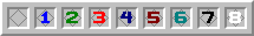
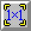
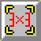

# RogueSweeper

This is RogueSweeper, an extension/re-make of my <a href="https://github.com/SmileyFace799/javasweeper_infinite">JavaSweeper Infinite</a> Java project, which again is a discontinued & unfinished re-make of my <code>Minesweeper Infinite</code> Python project (source code lost), which is quite simply Minesweeper, but progressively generated & infinite. However, this version aims to not just make infinite minesweeper, but also to expand on it & turn it into a roguelite.

 <h1 id="table-of-contents"></h1>

<ol>
    <li>[How to play](#how-to-play)<ol>
        <li>[Tile reference](#tile-reference)<ol>
            <li>[Regular number tiles](#regular-number-tiles)</li>
            <li>[Defused number tiles](#defused-number-tiles)</li>
            <li>[Bomb tile](#bomb-tile)</li>
            <li>[Life tile](#life-tile)</li>
            <li>[Bad chance reduction tile](#bad-chance-reduction-tile)</li>
            <li>[Power-up tiles](#power-up-tiles)</li>
            <li>[Cross number tiles (Currently unused)](#cross-number-tiles-currently-unused)</lI>
            <li>[Plus number tiles (Currently unused)](#plus-number-tiles-currently-unused)</lI>
            <li>[Diamond number tiles (Currently unused)](#diamond-number-tiles-currently-unused)</lI>
        </ol></li>
        <li>[Power-up reference](#power-up-reference)<ol>
            <li>[Small solver](#small-solver)</li>
            <li>[Medium solver](#medium-solver)</li>
            <li>[Large solver](#large-solver)</li>
            <li>[Defuser](#defuser)</li>
        </ol></li>
    </ol></li>
    <li>[Development info](#development-info)<ol>
        <li>[Deadline](#deadline)</li>
        <li>[Goals of this project](#goals-of-this-project)</li>
        <li>[Features](#features)</li>
    </ol></li>
</ol>

 <h1 id="how-to-play"></h1>

All the standard rules of minesweeper apply in this game, you can click on squares to open them, you wanna open as many squares as possible, while avoiding the bad squares. You can right click to place flags, and if you've found/marked every bad square around a number, you can middle click to instantly reveal the remaining squares around that number. However, there are also some new tiles you might encounter, and a full reference on every tile you can encounter is listed below.

## Tile Reference
### Regular number tiles:

<ul>
    <li><b>Type:</b> Number</li>
    <li><b>Severity:</b> Neutral</li>
    <li><b>Spawns from:</b> Natural generation</li>
    <li><b>Effect:</b> Counts how many bad squares exist within its coverage</li>
    <li><b>Coverage:</b> 
    </li>
</ul>

### Defused number tiles:

<ul>
    <li><b>Type:</b> Number</li>
    <li><b>Severity:</b> Bad</li>
    <li><b>Spawns from:</b> [Defuse power-up](#defuser)</li>
    <li><b>Effect:</b> Counts how many bad squares exist within its coverage (Does <b>not</b> count itself)</li>
    <li><b>Coverage:</b> 
    </li>
</ul>

### Bomb tile:

<ul>
    <li><b>Type:</b> Special</li>
    <li><b>Severity:</b> Bad</li>
    <li><b>Spawns from:</b> Natural generation</li>
    <li><b>Effect:</b> Lose a life</li>
</ul>

### Life tile:

<ul>
    <li><b>Type:</b> Special</li>
    <li><b>Severity:</b> Good</li>
    <li><b>Spawns from:</b> Natural generation</li>
    <li><b>Effect:</b> Gain a life</li>
</ul>

### Bad chance reduction tile:

<ul>
    <li><b>Type:</b> Special</li>
    <li><b>Severity:</b> Good</li>
    <li><b>Spawns from:</b> Natural generation</li>
    <li><b>Effect:</b> Reduce the chance of generating bad squares in the future (Does not affect squares that are already generated)</li>
</ul>

### Power-up tiles:

<ul>
    <li><b>Type:</b> Special</li>
    <li><b>Severity:</b> Good</li>
    <li><b>Spawns from:</b> Natural generation</li>
    <li><b>Effect:</b> Gain a [power-up](#power-up-reference) of the corresponding type (see image)</li>
</ul>

### Cross number tiles (Currently unused):

<ul>
    <li><b>Type:</b> Number</li>
    <li><b>Severity:</b> Neutral</li>
    <li><b>Spawns from:</b> Nothing</li>
    <li><b>Effect:</b> Counts how many bad squares exist within its coverage</li>
    <li><b>Coverage:</b> 
    </li>
</ul>

### Plus number tiles (Currently unused):

<ul>
    <li><b>Type:</b> Number</li>
    <li><b>Severity:</b> Neutral</li>
    <li><b>Spawns from:</b> Nothing</li>
    <li><b>Effect:</b> Counts how many bad squares exist within its coverage</li>
    <li><b>Coverage:</b> 
    </li>
</ul>

### Diamond number tiles (Currently unused):

<ul>
    <li><b>Type:</b> Number</li>
    <li><b>Severity:</b> Neutral</li>
    <li><b>Spawns from:</b> Nothing</li>
    <li><b>Effect:</b> Counts how many bad squares exist within its coverage</li>
    <li><b>Coverage:</b> 
    </li>
</ul>

## Power-Up Reference
Power-ups are a new addition to this game, to spice up the gameplay & to add some more strategy. These are active-use effects that can be selected & used on a single tile. To use one, simply select the power-up to use, then left click on a tile on the board to use it there. Right clicking with a power-up selected deselects it.

### Small solver:

<ul>
    <li><b>Area of effect:</b> 1x1</li>
    <li><b>Effect:</b> For every affected tile, places a flag on it if it's a bad square, otherwise opens it. Does nothing on already opened tiles</li>
</ul>

### Medium solver:

<ul>
    <li><b>Area of effect:</b> 3x3</li>
    <li><b>Effect:</b> For every affected tile, places a flag on it if it's a bad square, otherwise opens it. Does nothing on already opened tiles</li>
</ul>

### Large solver:

<ul>
    <li><b>Area of effect:</b> 5x5</li>
    <li><b>Effect:</b> For every affected tile, places a flag on it if it's a bad square, otherwise opens it. Does nothing on already opened tiles</li>
</ul>

### Defuser:

<ul>
    <li><b>Area of effect:</b> 1x1</li>
    <li><b>Effect:</b> If the target tile is a bad square, nullify its effect & place a [defused number tile](#defused-number-tiles) there instead</li>
</ul>

 <h1 id="development-info"></h1>

## Deadline

The deadline for the MVP of the project is 6/1/2025. Anything outside the MVP will not be prioritized until after this deadline. Beyond the deadline, this will probably become more of a "passion project", where development will happen whenever I feel like it, without any time constraints.

## Goals of this project

The "end goal" of this project is simply infinite Minesweeper, but expanded with some unique features to adapt it into a roguelite. There's a few smaller goals along the way (listed below), which will be checked off as the project develops. More specific goals will be tracked using an issue board after MVP has been reached.

<b>List of goals (within deadline):</b>
<ol>
    <li>Create a runnable project with core Minesweeper gameplay: ✅</li>
    <li>Create a playable infinite Minesweeper game: ✅</li>
    <li>Add simple roguelike elements to the game: ✅</li>
    <li>Playtesting & bugtesting, finished & playable MVP created: ✅</li>
</ol>

## Features

<i>NOTE: This section may change as the project develops. 
It does not cover standard Minesweeper mechanics, as those are implicitly included within MVP</i>

<b>Features to be implemented into the MVP (within deadline):</b>
<ul>
    <li>Progressively generated board: ✅</li>
    <li>Progressively incrementing mine chance: ✅</li>
    <li>Additional lives, with squares or other items that can give them: ✅</li>
    <li>Squares or other items that reduce incrementing mine chance in some way: ✅</li>
    <li>Different types of number squares, that reveal mine info in different ways than a standard number square: ✅
    <ul>
<li>Cross square: ✅

        X...X
        .X.X.
        ..O..
        .X.X.
        X...X
</li><li>Plus square: ✅

        ..X..
        ..X..
        XXOXX
        ..X..
        ..X..
</li><li>Diamond square: ✅

        ..X..
        .X.X.
        X.O.X
        .X.X.
        ..X..
</li>
    </ul></li>
    <li>Save & load functionality, persistent storage: ✅</li>
    <li>Upgrades <del>that persist between games</del>: ✅</li>
    <li>Movable & zoomable camera: ✅</li>
    <li>Game can be restarted: ✅</li>
    <li>Basic functional UI: ✅<ul>
        <li>Main Menu / Title screen: ✅</li>
        <li>Pause screen: ✅</li>
        <li>SIdebar with... ✅<ul>
            <li>Game info: ✅</li>
            <li>Upgrade display: ✅</li>
        </ul></li>
    </ul></li>
    <li><del>Complete graphics, no placeholder textures: ⭕</del> <i>(Ended up just using standard minesweeper textures)</i></li>
</ul>

<b>Extra features beyond MVP (after deadline):</b>
<ul>
    <li>User-friendly & polished UI: ❌</li>
    <li>Sounds & audio feedback: ❌</li>
    <li>Music: ❌</li>
    <li>Animations: ❌</li>
    <li>Configurable settings & settings menu: ❌</li>
    <li>In-game tutorial: ❌</li>
    <li>Chunk-based storage of the board, to actually support near-infinite board sizes: ❌</li>
    <li>More types of number squares: ❌
    <ul>
<li>Knight square: ❌

        .X.X.
        X...X
        ..O..
        X...X
        .X.X.
</li><li>Star square: ❌

        X...X
        ..X..
        .XOX.
        ..X..
        X...X

</li><li>Distant square: ❌

        X.X.X
        .....
        X.O.X
        .....
        X.X.X
</li><li>Arrow square: ❌

        ..X..  |  .....  |  ..X..  |  ..X..
        .XXX.  |  .....  |  .XX..  |  ..XX.
        XXOXX  |  XXOXX  |  XXO..  |  ..OXX
        .....  |  .XXX.  |  .XX..  |  ..XX.
        .....  |  ..X..  |  ..X..  |  ..X..
</li><li>Line square: ❌

        (Just 8 squares in a straight line out from the square)
</li><li>Dual line square: ❌

        (Just 4 squares in a straight line out from the square on opposite sides, for 8 squares total)
</li>
    </ul></li>
    <li>Directional variants of some number squares, that offset or change direction of their influence: ❌</li>
    <li>Bomb square variants, with other negative effects: ❌</li>
    <li>Large squares, occupying more than one space: ❌</li>
</ul>

